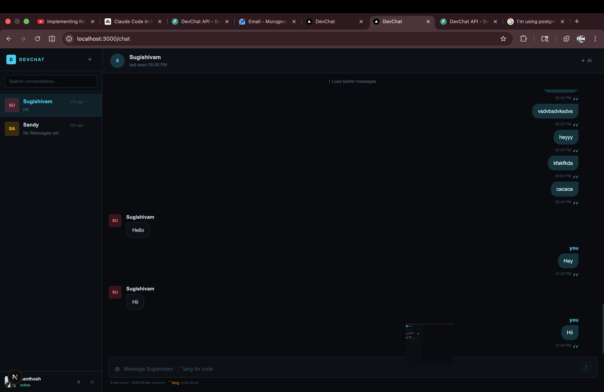
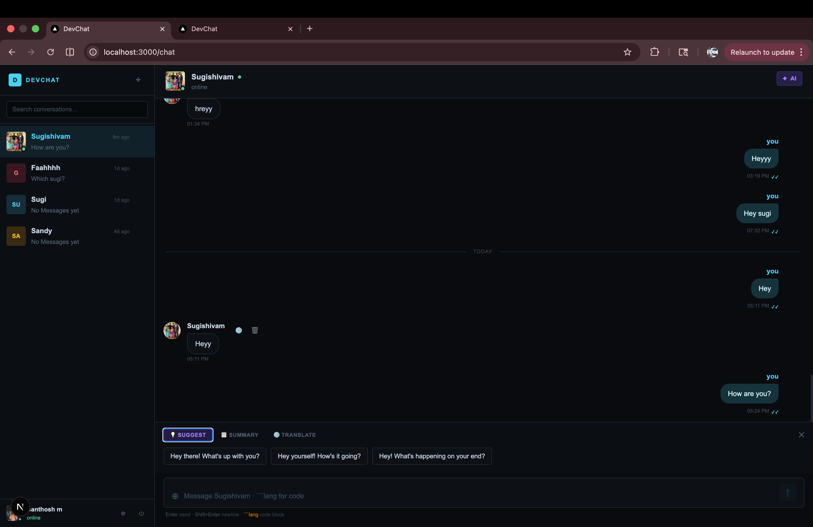
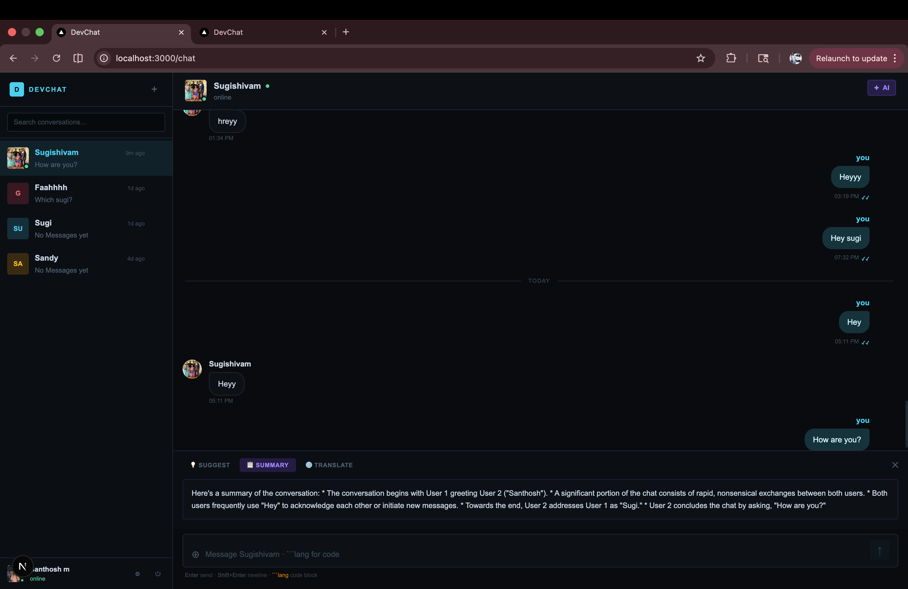

# DevChat

DevChat is a full-stack real-time chat application built as a portfolio-ready project with direct messaging, group conversations, AI-assisted chat tools, profile management, media/file sharing, and a responsive chat experience across desktop and mobile.


## Overview

DevChat is designed to feel like a modern messaging product while still being understandable to recruiters, collaborators, and reviewers reading the codebase. It combines:

- real-time chat over WebSockets
- REST APIs for auth, conversations, messages, uploads, profile flows, and AI utilities
- direct and group chat management
- image, video, file, and code sharing
- AI-powered summarization, smart replies, and translation
- mobile-friendly chat, auth, profile, and modal flows
- server-side encryption at rest for message bodies

## Core Features

- Email/password authentication with JWT-based session handling
- Direct 1:1 conversations
- Group chat creation, participant management, leave/remove flows, and admin-aware group info
- Real-time delivery, read receipts, typing indicators, and presence updates
- File uploads with presigned S3 URLs
- Inline image preview, inline video playback, attachment download support, and code block rendering
- Profile editing with avatar upload, crop/adjust flow, and avatar removal
- AI tools for summary, smart replies, and translation
- Responsive UI across desktop, tablet, and mobile layouts

## Screens

- Chat workspace with sidebar, active conversation window, AI tools, and group info modal
- Login and registration flows with polished terminal-inspired styling
- Profile page with avatar viewer/editor and account actions
- Group management modal for admins and members

## Tech Stack

### Frontend

- Next.js 16
- React 19
- TypeScript
- Tailwind CSS 4
- Axios
- Shiki for syntax-highlighted code messages
- React Hot Toast

### Backend

- FastAPI
- SQLAlchemy async
- PostgreSQL-compatible relational storage
- Redis for presence, unread counters, and realtime side-channel events
- Boto3 with S3 presigned uploads
- Google Gemini APIs for AI helpers
- `cryptography` for message encryption at rest

## High-Level Architecture

1. The frontend authenticates the user and stores the access token client-side.
2. REST APIs handle login, user profile, conversation setup, uploads, and message history.
3. Each open conversation establishes a WebSocket connection for live chat events.
4. Redis helps coordinate presence, unread counts, read receipts, and cross-session delivery events.
5. Message bodies are encrypted before being written to the database and decrypted by the backend only when needed for chat rendering or AI flows.
6. Uploads are sent directly to S3 using presigned URLs, then referenced inside messages.

## Repository Structure

```text
devchat/
├── .github/
│   └── workflows/
│       └── deploy.yml
├── backend/
│   ├── routers/
│   │   ├── ai.py
│   │   ├── auth.py
│   │   ├── conversation.py
│   │   ├── messages.py
│   │   ├── uploads.py
│   │   ├── users.py
│   │   └── websocket.py
│   ├── tests/
│   │   ├── test_group_and_profile.py
│   │   ├── test_message_crypto.py
│   │   └── test_upload_rules.py
│   ├── .dockerignore
│   ├── Dockerfile
│   ├── auth.py
│   ├── database.py
│   ├── limiter.py
│   ├── main.py
│   ├── message_crypto.py
│   ├── models.py
│   ├── redis_client.py
│   ├── requirements.txt
│   ├── schemas.py
│   └── upload_rules.py
├── docs/
│   └── images/
├── frontend/
│   ├── app/
│   │   ├── chat/
│   │   ├── login/
│   │   ├── profile/
│   │   ├── register/
│   │   ├── favicon.ico
│   │   ├── globals.css
│   │   ├── layout.tsx
│   │   └── page.tsx
│   ├── components/
│   │   ├── chat/
│   │   │   ├── Chatlist.tsx
│   │   │   ├── Chatwindow.tsx
│   │   │   ├── Codeblock.tsx
│   │   │   ├── GroupInfoModal.tsx
│   │   │   └── Messagebubble.tsx
│   ├── context/
│   │   └── AuthContext.tsx
│   ├── hooks/
│   │   ├── useConversations.ts
│   │   ├── useGlobalSocket.ts
│   │   └── useWebSocket.ts
│   ├── lib/
│   │   ├── ai.ts
│   │   ├── auth.ts
│   │   ├── axios.ts
│   │   ├── conversations.ts
│   │   ├── messages.ts
│   │   ├── uploads.ts
│   │   ├── users.ts
│   │   └── utils.ts
│   ├── public/
│   │   ├── file.svg
│   │   ├── globe.svg
│   │   ├── next.svg
│   │   ├── vercel.svg
│   │   └── window.svg
│   ├── types/
│   │   └── index.ts
│   ├── eslint.config.mjs
│   ├── next.config.ts
│   ├── package.json
│   ├── postcss.config.mjs
│   ├── README.md
│   └── tsconfig.json
├── .gitignore
└── README.md
```

## Current Security Model

This project is positioned as a portfolio-grade application with meaningful security practices, without claiming WhatsApp-style end-to-end encryption yet.

### In Place

- Password hashing with `bcrypt`
- JWT-based authentication
- Per-conversation authorization checks on message and conversation endpoints
- Rate limiting and security headers in the FastAPI app
- Upload allowlist, file size limits, and filename sanitization
- HTTPS/WSS-ready architecture for deployment
- Server-side encryption at rest for `Message.content`

### Message Encryption at Rest

Message bodies are encrypted on the backend before they are stored in the database.

- algorithm: `AES-256-GCM`
- scope: `Message.content`
- storage: encrypted payload is stored in the existing message content column
- decryption: handled server-side when returning history, conversation previews, or AI input

This protects message bodies at rest in the database, but it is not end-to-end encryption because the server can still decrypt the content.

### Recommended Environment Variable

Set a dedicated encryption secret in the backend environment:

```bash
MESSAGE_ENCRYPTION_KEY=replace-this-with-a-long-random-secret
```

If `MESSAGE_ENCRYPTION_KEY` is missing, the app falls back to hashing `SECRET_KEY`, which is acceptable for development but not ideal for production separation of concerns.

## Portfolio-Grade Security Checklist

Use this checklist as the intended project security scope:

- HTTPS and WSS enabled in deployment
- Strong password hashing
- JWT expiration and safe auth refresh handling
- Route-level authorization checks
- Input validation across auth, conversations, messages, and uploads
- File upload allowlist, size limits, and sanitized filenames
- Rate limiting on sensitive or spam-prone flows
- Message encryption at rest
- Secrets stored in environment variables or a secret manager
- Sensitive content excluded from logs where possible
- Tests for permissions, uploads, and crypto helper behavior
- Clear documentation of current protections and future security roadmap

## E2EE Roadmap

End-to-end encryption is intentionally a future enhancement instead of the current security model.

### Why It Is Deferred

- the current AI summary/smart-reply flow runs server-side and needs plaintext access
- true WhatsApp-style E2EE requires client-side key management and protocol work
- multi-device sync and group key distribution add significant complexity

### Planned E2EE Milestones

1. Add per-user identity keys and prekeys
2. Move direct-message encryption to the client
3. Store only ciphertext and metadata on the server
4. Add Sender Keys for group messaging
5. Redesign AI as an explicit client-decrypt and opt-in AI action

## AI Flow

DevChat currently supports:

- conversation summary
- smart reply suggestions
- translation

These are backend-assisted features today. Because the server decrypts messages for this flow, the app currently favors usability and product demonstration over strict end-to-end privacy.

For a future E2EE version, AI should become one of these:

- client-side decrypt plus user-approved cloud AI request
- local/on-device AI inference

### AI UI Preview

Main chat workspace with the AI entry point visible in the conversation header:



Suggested replies panel for quick response generation:



Conversation summary panel showing the current summarization flow:



## Local Development

### Backend

```bash
cd backend
python3 -m venv venv
source venv/bin/activate
pip install -r requirements.txt
uvicorn main:app --reload
```

The API runs on `https://98.83.41.208.sslip.io` by default.

### Frontend

```bash
cd frontend
npm install
npm run dev
```

The frontend runs on `http://localhost:3000`.

## Environment Variables

### Backend

Typical backend variables include:

```bash
SECRET_KEY=your-jwt-secret
ALGORITHM=HS256
DATABASE_URL=your-database-url
REDIS_URL=your-redis-url
AWS_ACCESS_KEY_ID=...
AWS_SECRET_ACCESS_KEY=...
AWS_REGION=...
S3_BUCKET=...
GOOGLE_API_KEY=...
FRONTEND_URL=http://localhost:3000
MESSAGE_ENCRYPTION_KEY=your-message-encryption-secret
```

### Frontend

Typical frontend variables include:

```bash
NEXT_PUBLIC_API_URL=http://localhost:8000
NEXT_PUBLIC_WS_URL=ws://localhost:8000/ws
```

## Upload Support

The app supports:

- images
- videos
- documents and archives
- programming and source files such as `ts`, `tsx`, `js`, `py`, `java`, `cpp`, `sql`, `html`, `css`, `json`, `md`, `Dockerfile`, and more

Images preview inside chat, videos render inline, and other attachments are downloadable directly from the conversation view.

## Realtime Features

- per-conversation WebSocket connections
- optimistic send flow
- typing indicators
- read receipts
- online/offline presence
- membership updates for group participants

## Notable UX Decisions

- terminal-inspired visual language across auth and chat
- mobile sidebar behavior tailored for conversation-first use
- responsive composer, modals, group management, and profile flows
- syntax-highlighted code blocks
- in-chat image preview instead of pushing users out to a new tab

## Testing and Verification

Examples of verification used in this project include:

- frontend linting
- frontend TypeScript checks
- backend unit tests for upload rules and message encryption helpers
- backend feature tests for group/profile flows

## What Makes This a Strong Portfolio Project

- It demonstrates full-stack ownership from UX to backend data flow.
- It includes realtime systems, auth, uploads, AI integration, and responsive UI.
- It shows pragmatic security decisions instead of hand-wavy claims.
- It documents both the current production-ready scope and the future E2EE roadmap clearly.
