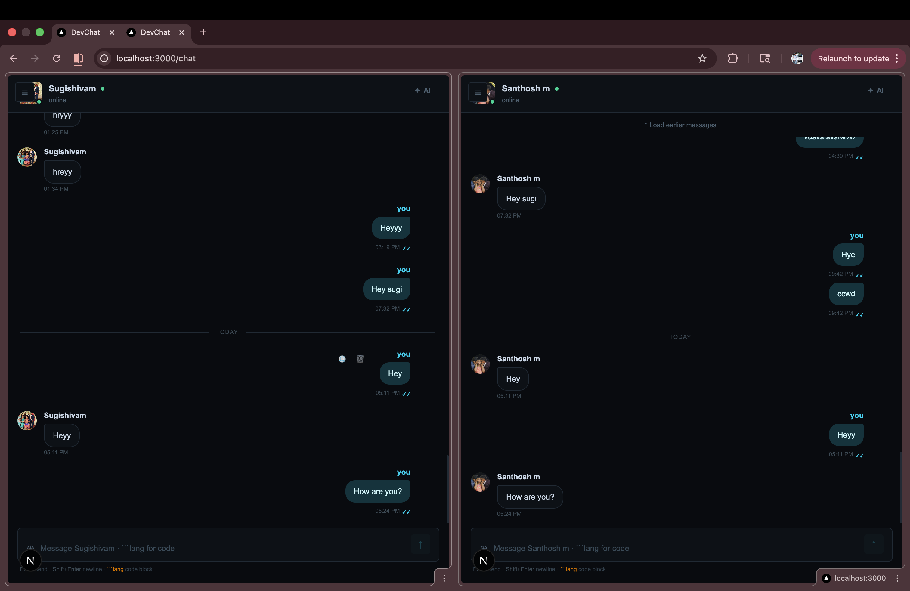

# DevChat

DevChat is a full-stack real-time chat application built as a portfolio-ready project with direct messaging, group conversations, AI-assisted chat tools, profile management, media/file sharing, and a responsive chat experience across desktop and mobile.



## What The Project Does

- Authenticates users with email/password and JWT bearer tokens
- Supports direct conversations and admin-aware group conversations
- Delivers live messages, typing indicators, presence events, and read receipts over WebSockets
- Stores message bodies encrypted at rest on the backend
- Supports presigned S3 uploads for images, videos, files, and source-code attachments
- Provides AI-powered conversation summaries, smart replies, and translation
- Includes a responsive Next.js frontend for login, chat, registration, and profile management

## Repository Layout

```text
devchat/
├── backend/
│   ├── auth.py
│   ├── database.py
│   ├── limiter.py
│   ├── main.py
│   ├── message_crypto.py
│   ├── models.py
│   ├── redis_client.py
│   ├── routers/
│   ├── schemas.py
│   └── upload_rules.py
├── docs/
│   └── images/
├── frontend/
│   ├── app/
│   │   ├── chat/
│   │   ├── login/
│   │   ├── profile/
│   │   ├── register/
│   │   ├── favicon.ico
│   │   ├── globals.css
│   │   ├── layout.tsx
│   │   └── page.tsx
│   ├── components/
│   │   ├── chat/
│   │   │   ├── Chatlist.tsx
│   │   │   ├── Chatwindow.tsx
│   │   │   ├── Codeblock.tsx
│   │   │   ├── GroupInfoModal.tsx
│   │   │   └── Messagebubble.tsx
│   ├── context/
│   ├── hooks/
│   ├── lib/
│   └── types/
└── README.md
```

## Stack

### Frontend

- Next.js 16 App Router
- React 19
- TypeScript
- Tailwind CSS 4
- Axios
- Shiki and `highlight.js` for code rendering
- React Hot Toast
- Framer Motion

### Backend

- FastAPI
- SQLAlchemy async
- PostgreSQL via `asyncpg`
- Redis for presence, unread counts, typing, and realtime coordination
- AWS S3 presigned uploads via `boto3`
- Google Gemini (`gemini-2.5-flash`) for AI endpoints
- `cryptography` AES-GCM helpers for message encryption at rest

## Architecture

### Request/response flow

1. The frontend authenticates the user and stores the JWT in `sessionStorage`.
2. Axios attaches the bearer token to REST calls automatically.
3. FastAPI routers handle auth, conversations, messages, uploads, users, and AI features.
4. SQLAlchemy persists users, conversations, participants, and messages.
5. Redis tracks online state, read status, unread counts, and WebSocket coordination.
6. WebSocket connections keep the chat UI in sync with typing, presence, read receipts, and live messages.

### Security model

- Passwords are hashed with `bcrypt`
- JWT access tokens authenticate REST and WebSocket flows
- Message bodies are encrypted at rest before persistence
- Uploads are filtered through extension and MIME allowlists
- Auth routes are rate-limited with `slowapi`
- Security headers are applied by backend middleware

### Important tradeoff

This project is not end-to-end encrypted today. The backend decrypts message content for REST responses and AI helpers, which keeps the product simpler to demo but means the server can access plaintext. The existing code and documentation treat true E2EE as a future roadmap item.

## Backend API Summary

### Auth

- `POST /auth/register`
- `POST /auth/login`
- `POST /auth/token`

### Users

- `GET /users/me`
- `PUT /users/me`
- `DELETE /users/me/avatar`
- `GET /users/search?q=...`

### Conversations

- `GET /conversations`
- `POST /conversations/direct`
- `POST /conversations/group`
- `GET /conversations/{conversation_id}`
- `PUT /conversations/{conversation_id}`
- `POST /conversations/{conversation_id}/participants`
- `DELETE /conversations/{conversation_id}/participants/{user_id}`
- `DELETE /conversations/{conversation_id}/leave`

### Messages

- `GET /messages/{conversation_id}`
- `POST /messages/{conversation_id}`
- `DELETE /messages/{message_id}`
- `GET /messages/{conversation_id}/unread`
- `POST /messages/{conversation_id}/read`

### Uploads

- `POST /uploads/presigned-url`

### AI

- `POST /ai/summarize`
- `POST /ai/smart-reply`
- `POST /ai/translate`

### WebSockets

- `WS /ws/{conversation_id}?token=...`
- `WS /ws/user/{user_id}?token=...`

## Data Model

### User

- Account identity, password hash, display name, avatar URL, online metadata, timestamps

### Conversation

- Direct or group chat container with optional group name/avatar and creator reference

### Participants

- Join table linking users to conversations
- Stores admin status, join timestamp, and hidden state for direct conversation leave behavior

### Message

- Message content, sender, conversation, message type, attachment URL, status, language, deletion flag, timestamps

## Code Organization

### Backend responsibilities

- `backend/main.py` wires the FastAPI app, middleware, routers, startup table creation, and health route
- `backend/auth.py` handles password hashing, JWT creation, and current-user lookup
- `backend/models.py` defines users, conversations, participants, and messages
- `backend/schemas.py` defines API request/response contracts
- `backend/message_crypto.py` encrypts and decrypts stored message bodies
- `backend/upload_rules.py` enforces safe upload names and content types
- `backend/routers/` contains feature routes for auth, users, conversations, messages, uploads, AI, and WebSockets
- `backend/tests/` contains backend unit tests for route logic and helpers

### Frontend responsibilities

- `frontend/app/` contains route-level pages and layout files
- `frontend/components/chat/` contains the main chat presentation components
- `frontend/context/AuthContext.tsx` manages client auth state
- `frontend/hooks/useWebSocket.ts` manages per-conversation realtime sockets
- `frontend/hooks/useGlobalSocket.ts` manages the user-level socket for global events
- `frontend/lib/` wraps API calls for auth, conversations, messages, uploads, users, and AI
- `frontend/types/` stores shared client-side TypeScript contracts

## WebSocket Event Model

### Conversation socket events

- `welcome`
- `message`
- `typing`
- `read`
- `presence`
- `membership`
- `pong`
- `error`

### Outgoing client frames

- `{"type":"message", ...}`
- `{"type":"typing", "is_typing": true|false}`
- `{"type":"read"}`
- `{"type":"ping"}`

### Global user socket purpose

The user-level WebSocket lets the frontend keep unread indicators, membership updates, read receipts, and presence changes in sync even when the user is not currently focused on a given conversation.

## Local Development

### Backend

```bash
cd backend
python3 -m venv venv
source venv/bin/activate
pip install -r requirements.txt
uvicorn main:app --reload
```

The API runs on `https://98.83.41.208.sslip.io` by default.

### Frontend

```bash
cd frontend
npm install
npm run dev
```

The frontend runs on `http://localhost:3000`.

## Environment Variables

### Backend

Typical backend variables include:

```bash
SECRET_KEY=your-jwt-secret
ALGORITHM=HS256
DATABASE_URL=your-database-url
REDIS_URL=your-redis-url
AWS_ACCESS_KEY_ID=...
AWS_SECRET_ACCESS_KEY=...
AWS_REGION=...
S3_BUCKET=...
GOOGLE_API_KEY=...
FRONTEND_URL=http://localhost:3000
MESSAGE_ENCRYPTION_KEY=your-message-encryption-secret
```

### Frontend

Typical frontend variables include:

```bash
NEXT_PUBLIC_API_URL=http://localhost:8000
NEXT_PUBLIC_WS_URL=ws://localhost:8000/ws
```

## Upload Support

The app supports:

- images
- videos
- documents and archives
- programming and source files such as `ts`, `tsx`, `js`, `py`, `java`, `cpp`, `sql`, `html`, `css`, `json`, `md`, `Dockerfile`, and more

Images preview inside chat, videos render inline, and other attachments are downloadable directly from the conversation view.

## Realtime Features

- per-conversation WebSocket connections
- optimistic send flow
- typing indicators
- read receipts
- online/offline presence
- membership updates for group participants

## Notable UX Decisions

- terminal-inspired visual language across auth and chat
- mobile sidebar behavior tailored for conversation-first use
- responsive composer, modals, group management, and profile flows
- syntax-highlighted code blocks
- in-chat image preview instead of pushing users out to a new tab

## Testing and Verification

Examples of verification used in this project include:

- frontend linting
- frontend TypeScript checks
- backend unit tests for upload rules and message encryption helpers
- backend feature tests for group/profile flows

## What Makes This a Strong Portfolio Project

- It demonstrates full-stack ownership from UX to backend data flow.
- It includes realtime systems, auth, uploads, AI integration, and responsive UI.
- It shows pragmatic security decisions instead of hand-wavy claims.
- It documents both the current production-ready scope and the future E2EE roadmap clearly.
